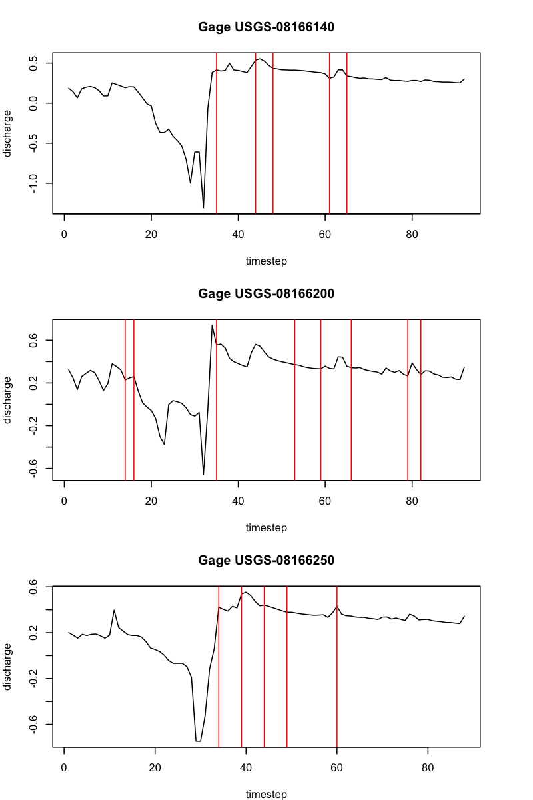

```{r setup, include=FALSE}
knitr::opts_chunk$set(echo = TRUE)
source('utils.R')
library(leaflet)
library(nhdplusTools)
library(knitr)
library(Rcpp)
library(microbenchmark)
library(rstan)
```
# Main research question


# Hypothesis

# Introduction to the data

The U.S. Geological Survey (USGS) river gage data provides continuous monitoring 
of streamflow conditions across thousands of sites in the United States. These 
gages measure the height (stage) of a river or stream, which is then used to 
estimate the flow rate or discharge—typically reported in cubic feet per second 
(cfs). Data collection is done using automated instruments such as pressure 
transducers, radar sensors, or float-operated devices that record water level 
at regular intervals. Flow measurements are derived from stage-discharge 
relationships established through field measurements using techniques like 
current meters or acoustic Doppler devices. The USGS reports this data in near 
real-time via its National Water Information System (NWIS), making it accessible 
for flood forecasting, water resource management, and ecological studies.

For this project, I focused on three gages in Kerr County Texas, between June
and August 2025.

```{r data_pull, cache=TRUE}
data<-data.pull() # wrapper for USGS API, defined in utils.R
site_ids<- unique(data$monitoring_location_id)
pour_points <- data.frame(featureSource = rep("nwissite", length(site_ids)), 
                    featureID = site_ids) 
upstream_network<-apply(pour_points, 1, navigate_nldi, mode="upstreamMain")
flowlines <- do.call(rbind, lapply(upstream_network, function(x) x$UM_flowlines))

leaflet(data = data) %>%
  addTiles() %>%
  addMarkers(data=data, popup = ~monitoring_location_id) %>%
  addPolylines(data=flowlines, color='blue')%>%
  addCircleMarkers(data=data,
                   radius = 5, 
                   color = "blue", 
                   stroke = FALSE, 
                   fillOpacity = 0.7) %>%
  setView(lng = -99.14, lat = 30.05, zoom = 11)
```
These three sites are directly connected by the stream network that flows from
the northernmost gage site (USGS-08166140) through the central gage site 
(USGS-08166200) to the southernmost gage site (USGS-08166250). Of note, due to 
Kerr County's proximity to the gulf, weather systems frequently move from south
to north, which may explain why discharge increases first in the south before
increasing in upstream gages.

```{r plot_discharge}
data <- data.resolveNA(data) # defined in utils.R
plot(NULL, 
     xlim = range(data$time), xaxt = "n",
     ylim = range(log10(data$discharge_max)),
     xlab = "Date", ylab = "Log Discharge (cfs)", 
     main = "Log Discharge Over Summer 2025 by Site")
axis(side = 1, at = data$time, labels = format(data$time, "%d %b"), las = 2)
discharge_sites <- unique(data$monitoring_location_id)
colors <- rainbow(length(discharge_sites))
for (i in seq_along(discharge_sites)) {
  site_data <- subset(data, 
                      monitoring_location_id == discharge_sites[i])
  lines(site_data$time, log10(site_data$discharge_max), col = colors[i], lwd = 2)
}
legend("topright", legend = discharge_sites, col = colors, lwd = 2)

```


A more in-depth exploration of this gage data set and flowlines connecting each 
gage is provided in `data_explore.R`

# Description of the Bayesian Model

The U.S. Geological Survey (USGS) has long employed a structured approach to 
modeling river gage flow, relying on statistical hydrology and empirical data 
analysis. Central to its methodology is the use of annual peak flow data, which 
are collected from thousands of gaging stations across the United States. These 
data serve as the foundation for flood frequency analysis, water resource 
planning, and hydrologic modeling. The statistical distribution most commonly 
used by the USGS for modeling peak flows is the Log-Pearson Type III 
distribution, as recommended in Bulletin 17B and 17C. This distribution is 
favored for its ability to accommodate skewness in the data and its suitability 
for log-transformed flow values. It assumes that annual peak flows are 
independent and identically distributed, and that their logarithms follow a 
Pearson Type III distribution—a form of the gamma distribution with skew.

Parameter estimation for the Log-Pearson III model typically involves 
calculating the mean, standard deviation, and skewness of the log-transformed 
peak flows, using methods such as the method of moments or maximum likelihood 
estimation. More recently, Bayesian techniques have been introduced to improve 
uncertainty quantification and incorporate regional information, especially in 
Bulletin 17C. This update also includes the Grubbs-Beck test for identifying 
low outliers and supports generalized skew estimation using regional data.
For low-flow statistics, such as the 7Q10 or 30Q5, the USGS often employs 
empirical frequency analysis and may use distributions like the log-normal or 
Weibull, though these are less standardized than those used for peak flows. 
Daily streamflow modeling, on the other hand, is typically handled through 
hydrologic simulation models such as HEC-HMS or SWAT, or through stochastic 
time series models like ARIMA.

Traditional USGS modeling assumes stationarity—that the statistical properties 
of streamflow do not change over time. It also assumes independence between 
annual peak flows and homogeneity of the data, meaning all observations are 
drawn from a single population. These assumptions are increasingly challenged 
by climate change, land use changes, and other nonstationary influences. 
As a result, newer methods, including Bayesian changepoint detection, are 
being explored to better capture shifts in hydrologic regimes and improve the 
robustness of flow modeling. [@England2018Bulletin17C]

## Application and Main features

The Log-Pearson Type III distribution is widely used in hydrology to model 
peak streamflows. It applies a Pearson Type III distribution to the 
log-transformed discharge data.

Let $Q$ be the annual peak discharge. Define:

$$
X = \log_{10}(Q)
$$
Then $X$ is assumed to follow a Pearson Type III distribution.

### Probability Density Function (PDF)

The PDF of the Pearson Type III distribution for $X$ is:

$$
f(x|\kappa, \theta,\tau) = \frac{(x - \tau)^{\kappa - 1} e^{-(x - \tau)/\theta}}
            {\theta^{\kappa} \Gamma(\kappa)}, \quad x > \tau
$$

Where:
- \( \kappa > 0 \) is the shape parameter  
- \( \theta > 0 \) is the scale parameter  
- \( \tau \) is the location parameter  
- \( \Gamma(\cdot) \) is the gamma function

The parameters can be estimated using the first three L-moments of past observed data (mean $\mu$, standard deviation $\sigma$, skewness $\gamma$).  

- shape $\kappa = (2/\gamma)^2$  
- scale $\theta = 2\sigma/\gamma$  
- location $\tau = \mu - \theta \cdot \kappa$. 

Note that shape and scale are both dependent on skewness $\gamma$. When two parameters in an MCMC sampler are highly correlated, the posterior distribution becomes elongated along a diagonal direction, making it difficult for standard proposal mechanisms to explore efficiently. This leads to slow mixing, high autocorrelation between samples, and poor convergence because the sampler must take very small steps to maintain reasonable acceptance rates. As a result, the effective sample size decreases, requiring many more iterations to achieve accurate estimates. Strong correlations also complicate convergence diagnostics and can cause numerical instability in adaptive algorithms.

### Hydrologic Parameterization

In hydrologic applications, the distribution is often parameterized using:
- Mean $\mu$
- Standard deviation $\sigma$
- Skew coefficient $\gamma$

These are computed from the log-transformed data $X = \log_{10}(Q)$, and used 
to estimate flood quantiles via:

$$
X_T = \mu + K_T \cdot \sigma
$$

Where:
- $X_T$ is the log of the discharge for return period $T$
- $K_T$ is a frequency factor that depends on $T$ and the skew $\gamma$

Then the estimated discharge for return period $T$ is:

$$
Q_T = 10^{X_T}
$$


## Other methods

In hydrologic modeling, both the log-normal distribution and the 
generalized extreme value (GEV) distribution are also commonly used to represent 
different aspects of streamflow behavior, particularly when analyzing discharge 
data from river gages.

The log-normal distribution is often applied to daily discharge values, 
especially when modeling typical flow conditions or low flows. This choice is 
motivated by the fact that streamflow data are strictly positive and often 
exhibit right-skewed behavior—meaning that most values are relatively low, but 
occasional high flows occur. By taking the logarithm of discharge values, 
the data tend to approximate a normal distribution, which simplifies statistical 
analysis and parameter estimation. The log-normal model is frequently used in 
water quality modeling, ecological studies, and operational forecasting.

The GEV distribution is specifically designed to model extreme values, such as 
annual maximum daily discharges or flood peaks. It encompasses three types of 
extreme value distributions (Gumbel, Frechet, and Weibull) through its shape 
parameter, allowing flexibility in modeling different tail behaviors. The GEV 
is grounded in extreme value theory, which states that the distribution of 
block maxima (e.g., yearly maximum flows) converges to a GEV distribution under 
broad conditions. This makes it particularly suitable for flood frequency 
analysis, infrastructure design, and risk assessment, where understanding the 
probability of rare but high-impact events is critical.

For the purposes of this report, only the Log-Pearson III distribution is used for
setting the prior belief.

# Implementation of the model

The prior beleif is set based on the 2024 summer flows of the same gages.

```{r priors, cache=TRUE, results='asis'}
data.prev <- data.pull(datestring="2024-06-01T00:00:00Z/2024-08-31T00:00:00Z")
data.prev <- data.resolveNA(data.prev)

# est.params defined in my_functions.R using method of moments
plot.density(data.prev)
gage.data.prev <- split(data.prev$discharge_max,
                        data.prev$monitoring_location_id)
params <- purrr::map(lapply(gage.data.prev, est.lp3), 'para')
kable_tables <- lapply(names(params), function(name) {
      df <- params[[name]]
      kable(t(df), caption = name)
    })
kable_tables
```


This report compares three different implementations of Bayesian Online 
Changepoint Detection (BOCPD). First, an analytical implementation using 
gamma-gamma conjugate priors, then an MCMC sampling method. Finally a brief 
demonstration is shown of the `Rbeast` package using an ensemble algorithm method.

## Analytical implementation using conjugate priors

The full implementation of this method is provided in `bocpd_gamma.cpp` and
is imported into R using the `Rcpp` package. This method is implemented based
on the procedure explained in @AdamsMacKay2007.
```{r cpp}
sourceCpp(file='analytical_bocpd/bocpd_gamma.cpp')
```

For this solution, we use a simplified model where $X \sim \text{Gamma}(\alpha,\beta)$  with shape parameter $\alpha$
and rate parameter $\beta$ (inverse of scale).

With a Gamma-Gamma conjugage prior, the likelihood is Gamma and the conjugate prior for the rate 
parameter $\beta$ (given $\alpha$) is also Gamma.

- Prior: $\beta \sim \text{Gamma}(a_0, b_0)$   
- Likelihood: $x_i | \beta \sim \text{Gamma}(\alpha, \beta)$
- Analytical posterior (with $n$ observed data points): $\beta | x_{1:n}\sim \text{Gamma}(a_0+n\alpha, b_0+\sum_{i=1}^n x_i)$


With online updates, we can only see past data at each timestep. When a new observation $x_t$ arrives:

- update sufficient statistics  
  * $n \gets n+1$  
  * $S \gets S+x_t$  

- Posterior becomes $\beta|x_{1:n} \sim \text{Gamma}(a_0+n\alpha, b_0 +S)$  

Where $S$ is the running sum $\sum_{i=1}^n x_i$.  


Using @AdamsMacKay2007 BOCPD framework,  

- Maintain a run-length distribution $\Pr(r_t|x_{1:t})$ where $r_t = \text{number of observations since last changepoint}$  

- For each possible run length, compute predictive probability $\Pr (x_t | r_t) = \int \Pr(x_t|\beta) \Pr(\beta | \text{data in run}) \delta \beta$. 

```{r analytical_implementation}
gage.data <- split(data$discharge_max, data$monitoring_location_id)

results <-  list()
for(gage in names(gage.data)){
  # gage values to assess in "real-time"
  gage_values <- gage.data[[gage]]
  
  # prior belief only based on past observed values
  prior <- est.lp3(gage.data.prev[[gage]])[['para']]
  
  # translate L-moments into log Pearson III parameters
  scale <- 2*prior[['sigma']]/prior[['gamma']]
  shape <- 4/prior[['gamma']]^2
  location <- prior[['mu']] - scale*shape
  
  results[[gage]] <- bocpd_pearsonIII(data = log10(gage_values)
                    , prior_shape = shape
                    , prior_scale = scale
                    , location = location
                    , hazard_lambda = 2
                    , adaptive_hazard = TRUE)
  
}

# plot results
plot.changepoints(gage.data, results)

```

Using analytical solutions with conjugate priors for Bayesian online changepoint detection offers significant benefits: it enables exact posterior updates in closed form, eliminating the need for iterative sampling and reducing computational overhead. This makes real-time processing fast and efficient, with low latency and high numerical stability. Additionally, the approach simplifies implementation by avoiding convergence diagnostics and parameter tuning, while scaling well to large datasets since updates depend only on the previous state and the new observation.

## MCMC implementation

The MCMC implementation uses `rstan` to define the model and then runs MCMC
sampling for each time step, using only previous time steps data. 

```{r eval=FALSE}
data {
  int<lower=1> N;
  array[N] real<lower=0> y;
  real<lower=0> shape_prior;
  real<lower=0> scale_prior;
  real location_prior;
}

parameters {
  real<lower=0> shape;
  real<lower=0> scale;
  real location;
}
model {
  // Priors
  shape ~ lognormal(shape_prior, 2);
  scale ~ lognormal(scale_prior, 2);
  location ~ normal(location_prior, 2);

  // Likelihood
  for (n in 1:N) {
    target += logpearson3_lpdf(y[n] | shape, scale, location);
  }
}
```

For each time step:  
- sample for each run length before current timestep  
- calculate the predictive probability of the observed posterior.  
- calculate the run length probability  
- calculate changepoint probability   
\[
P(r_t = 0 \mid x_{1:t}) \propto \sum_{r_{t-1}} P(r_t = 0 \mid r_{t-1}) \cdot P(x_t \mid r_{t-1}, x_{1:t-1}) \cdot P(r_{t-1}, x_{1:t-1})
\]

This method can become computationally expensive very quickly due to the recursive
nature of the changepoint probability requiring the calculation of the changepoint
probability of all possible run legths before the current time step.

An abreviated version of this algorithim is shown in `numerical_bocpd/mcmc_moving_window.R` that samples the posterior at each timestep
and calculates the change in individual parameters. 


Areas of the sequence where parameters change in quick succession can also slow 
sampling convergence as each timestep is heavily influenced by the prior parameters of the previous iteration.

## Ensemble Algorithim (Rbeast implementation)

Rbeast is an R package that uses Bayesian Estimator of Abrupt change, Seasonal change, and Trend (BEAST) \citep{ZHAO2019}

Combines:  
- Bayesian changepoint detection for time series.  
- Ensemble modeling to improve robustness and uncertainty quantification.  

Each model in the ensemble estimates number and location of changepoints, and segment-specific parameters (mean, trend, seasonality).

Models differ by: Prior settings (e.g., hazard rate, variance), sampling seeds, and different likelihood structures.

For each model: sample posterior over changepoints and parameters: $\Pr(changepoints,params|data)\Pr(changepoints, params data)\Pr(changepoints,params|data)$

The posterior can be computed analytically or computed via MCMC depending on likelihood structure.

Ensemble Aggregation combines posterior samples from all models.  

Compute:   
- Posterior inclusion probability for each time point being a changepoint.  
- Credible intervals for trends and seasonal components.


This reduces sensitivity to prior choices and improves stability.




# Comparisons of the implementations

## Comparisons of results

Both analytical and MCMC implementations successfully identified changepoints 
in the log-transformed discharge data across the three gage sites; however, 
they differ in sensitivity, resolution, and computational efficiency.

### Analytical (Gamma-Gamma Conjugate) Implementation:
This method produced changepoint probabilities with sharp transitions, often 
aligning with abrupt changes in discharge. It was extremely fast, with benchmark 
runtimes averaging around 1–1.1 seconds per gage series.
The adaptive hazard function allowed for flexible detection of changepoints 
without manual tuning across sites. However, it was "slow" to identify changepoints
online in that the probability of a changepoint did not increase until after multiple days
of elevated discharge.

### MCMC Implementation:

The MCMC-based  was significantly slower due to the need to run multiple chains 
per time step and segment, even with parallelization (logs with timestampes 
available in the `log` folder. The changepoint probabilities tended to be more 
more conservative but also sensitive to change, and this method was "faster" to
identify changepoints online in that when discharge drastically changes in just 
one or two timesteps, the estimated probability increases without the lag seen
in the analytical implementation.

Visual comparison of the changepoint probability plots shows that while both 
methods detect similar changepoint regions, the analytical method is more 
decisive, whereas the MCMC method provides richer uncertainty quantification.

A re-paramiterization of the log-Pearson III distribution in which the parameters
are less correlated with each other, may produce better sampling 
results. Additionally, controlling how much the prior belief changes between timesteps
could potentially help stabilize the sampling procedure.

## Commentary on implementation choices

The choice between the two implementations depends on the modeling goals. The 
analytical method is ideal for real-time applications or large-scale deployment 
due to its speed. It leverages conjugate priors and closed-form updates, making 
it computationally efficient. The MCMC method, while slower, offers deeper 
insight into posterior distributions. This is valuable when uncertainty 
matters—for example, in risk assessment or when informing policy decisions. Both 
methods incorporate priors derived from the 2024 summer data using the 
Log-Pearson Type III distribution. This consistency ensures comparability, 
but the analytical method directly uses the LP3 parameters, while the MCMC 
method approximates them via gamma priors.

The analytical method includes an adaptive hazard function, which improves 
changepoint detection in nonstationary environments. The MCMC method uses a 
fixed hazard rate, which may limit responsiveness to abrupt changes.

Overall, the analytical implementation is preferable for operational efficiency
and responsiveness, while the MCMC approach is better suited for exploratory 
analysis and uncertainty-aware modeling.

### Temporal Efficieny
One notable limitation of the MCMC implementation is its lack of temporal 
efficiency. Despite operating on time-series data, the model does not leverage 
the sequential structure of the streamflow observations. Instead, it 
re-samples the entire posterior space from scratch at each time step, using 
only the data from the current segment. This approach ignores the fact that 
posterior distributions from previous time steps could serve as informative 
priors for the next.

This design choice leads to several consequences.Re-running MCMC sampling for 
every possible segment at each time step is computationally expensive, 
even with parallelization. The model does not cache or reuse posterior samples, 
resulting in redundant computation. By treating each segment independently, 
the implementation misses an opportunity to model temporal dependencies or 
smooth transitions in parameter estimates. This can lead to inconsistent 
posterior behavior across adjacent time steps.

There are also scalability concerns. As the number of time steps increases, 
the number of segments grows quadratically, making the approach increasingly 
impractical for long time series or real-time applications.

A more efficient alternative would be to implement a sequential Bayesian 
updating scheme, where posterior distributions from previous time steps are 
propagated forward. This would preserve the time-series structure, reduce 
computational load, and improve the coherence of changepoint probability 
estimates..

# References